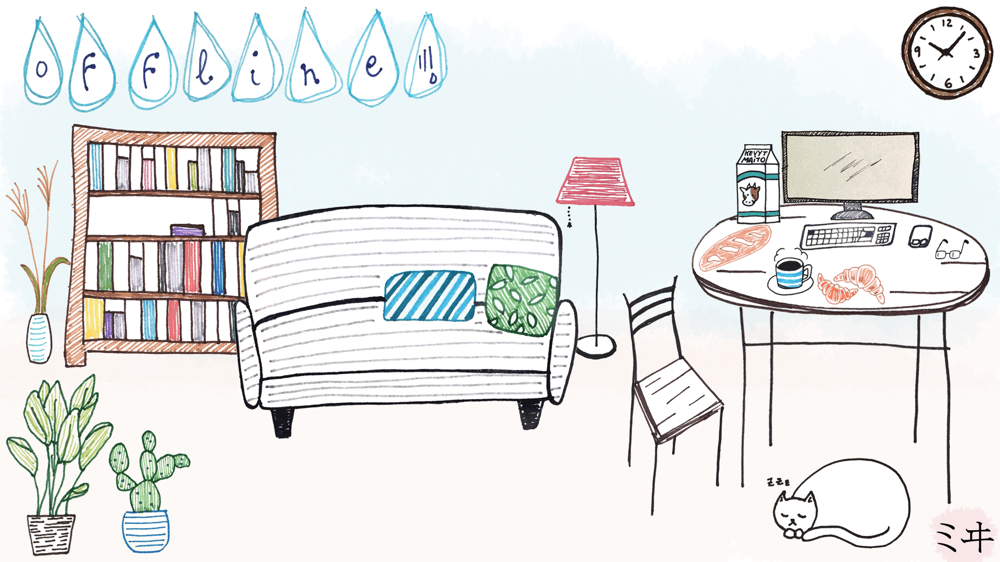

# [Twitch fun](https://www.twitch.tv/thibaudcolas)

> A place to keep all of my hard-earned Twitch streaming knowledge

## Tools

-   [Twitch](https://www.twitch.tv/)
-   [OBS](https://obsproject.com/)
-   [KeyCastr](https://github.com/keycastr/keycastr)
-   TODO: a better window position manager

## Hard-earned knowledge

-   Do not use scaled video output – stream with the canvas size.
-   Turn on recordings in Twitch as well as in OBS.

### Twitch

> Channel: https://www.twitch.tv/thibaudcolas

-   Timestamps for Twitch videos: [`?t=01h01m01s`](https://www.reddit.com/r/Kappa/comments/29a47v/psa_when_you_link_to_a_twitch_stream_heres_how_to/)
-   Channel art: 16:9, `1920x1080`

#### Guides

-   Reddit: [A Guide to Streaming and Finding Success on Twitch](https://www.reddit.com/r/Twitch/comments/4eyva6/a_guide_to_streaming_and_finding_success_on_twitch/), [Part 2: Equipment and Software](https://www.reddit.com/r/Twitch/comments/4ft9xn/a_guide_to_streaming_and_finding_success_on/)

### ffmpeg

-   Truncate video: `ffmpeg -i input.mp4 -ss hhfrom:mm:ss -to hhto:mm:ss -c copy output.mp4`
-   Concatenate videos: [https://stackoverflow.com/a/11175851/1798491](https://stackoverflow.com/a/11175851/1798491)

## License

To the extent possible under law, [Thibaud Colas](https://twitter.com/thibaud_colas) has waived all copyright and related or neighboring rights to this work.
